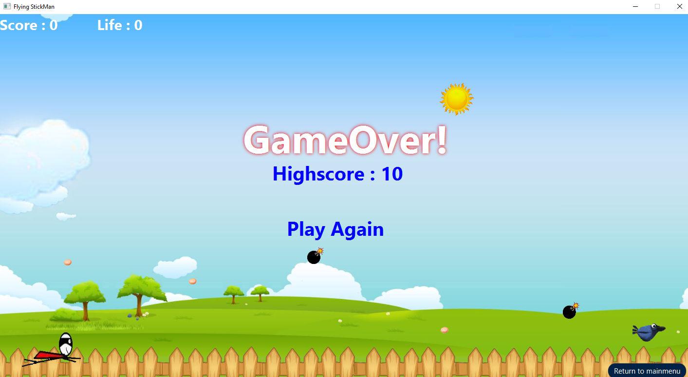

# FlyingStickman
A simple 2d game(using JavaFx).

It was developed as a course work for Java Lab course (2/1)
# Overview
A bird flying forward laying eggs relentlessly and you have to catch those. Sometimes it lays bomb and sometimes heart :p .
If you(egg shaped head) get in touch with bomb/fence you lose a life and if you touch a heart you achieve an extra life.

# Verison
Eclipse IDE for Java Developers

Version: Oxygen.3a Release (4.7.3a)

JDK 10.0.1

**SS of different pages**

 

